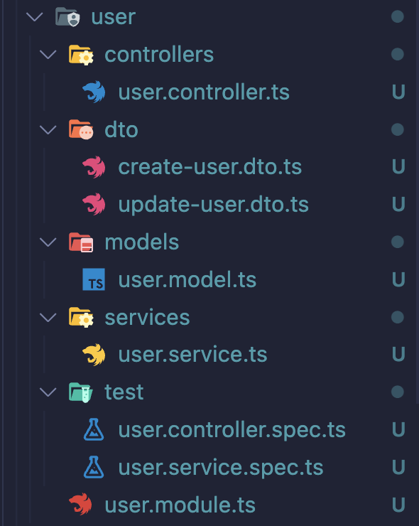
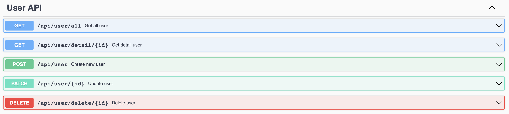

<p align="center">
  <a href="http://nestjs.com/" target="blank"></a>
</p>

[circleci-image]: https://img.shields.io/circleci/build/github/nestjs/nest/master?token=abc123def456
[circleci-url]: https://circleci.com/gh/nestjs/nest


## Description

A NestJS source for fast creating CRUD modules. Using OOP to reuse inheritable classes

## Installation

```bash
$ yarn install
```

## Config environment
```bash
$ cp .env.example .env.development
```

```bash
NODE_ENV=development | production | test
PORT= App Port
DB_HOST= Database Host
DB_PORT= Database Port
DB_USERNAME= Database Username
DB_PASSWORD= Database Password
DB_NAME= Database Name
REDIS_HOST= Redis Host
REDIS_PORT= Redis Port
REDIS_DB= Redis DB
REDIS_PASSWORD= Redis Password
SECRET_JWT= What ever
SECRET_KEY= What ever
SECRET_KEY_IV= What ever
```

## Running the app

```bash
# development
$ yarn run start

# watch mode
$ yarn run start:dev

# production mode
$ yarn run start:prod
```
## Docker
```bash
$ docker compose up -d --build
```

## Generate CRUD Module
I have customized @nestjs/schematics that will generate follow my own template.
```bash
$ nest g res module-name
```
Choose Restful and Yes when be asked for CRUD

## Structure
This is my customized template
```bash
module-name
├── controllers
├── dto
├── entities
├── services
└── test
```

## Base classes
### BaseEntity
```typescript
export class BaseEntity extends TypeormBaseEntity {
	@PrimaryGeneratedColumn('uuid')
	id!: string;

	@CreateDateColumn({ name: 'created_at' })
	createdAt!: Date;

	@UpdateDateColumn({ name: 'updated_at' })
	updatedAt!: Date;

	@DeleteDateColumn({ name: 'deleted_at' })
	@Exclude()
	@ApiHideProperty()
	deletedAt!: Date;
}
```
This class extends BaseEntity of typeorm. Already includes id and timestamp, that are necessary for all entities
### BaseService
```typescript
export abstract class BaseService<Entity extends BaseEntity> {
	abstract name: string;

	constructor(public readonly repo: Repository<Entity>) {}

	async getAll(): Promise<Entity[]> {
		...
	}

	async getAllWithPagination(): Promise<[Entity[], number]> {
		...
	}

	async getOne(): Promise<Entity | null> {
		...
	}

	async getOneById(): Promise<Entity | null> {
		...
	}

	async getOneOrFail(): Promise<Entity> {
		...
	}

	async getOneByIdOrFail(): Promise<Entity> {
		...
	}

	async create(): Promise<Entity> {
		...
	}

	async createMany(): Promise<Entity[]> {
		...
	}

	async update() {
		...
	}

	async updateBy() {
		...
	}

	async updateById() {
		...
	}

	async deleteBy() {
		...
	}

	async deleteById() {
		...
	}

	async softDelete() {
		...
	}

	async softDeleteById() {
		...
	}
}
```
This class include all methods that each module needed. 
- create, createMany
- getAll, getOne, getWithPagination
- update
- delete
- softDelete
### BaseController
```typescript
export function BaseController<Entity extends BaseEntity>($ref: any, name?: string) {
	abstract class Controller {
		abstract relations: string[];

		constructor(public readonly service: BaseService<Entity>) {}

		@Post('create')
		@ApiCreate($ref, name)
		create(@Body() body): Promise<Entity> {
			return this.service.create(body);
		}

		@Get('all')
		@ApiGetAll($ref, name)
		getAll(@Query() query: PaginationDto): Promise<[Entity[], number]> {
			return this.service.getAllWithPagination(
				query,
				{},
				//@ts-ignore
				{ createdAt: 'DESC' },
				...this.relations
			);
		}

		@Get('detail/:id')
		@ApiGetDetail($ref, name)
		getDetail(@Param('id') id: string): Promise<Entity> {
			return this.service.getOneByIdOrFail(id, ...this.relations);
		}

		@Patch('update/:id')
		@ApiUpdate($ref, name)
		update(@Param('id') id: string, @Body() body): Promise<Entity> {
			return this.service.updateById(id, body);
		}

		@Delete('delete/:id')
		@ApiDelete($ref, name)
		delete(@Param('id') id: string): Promise<Entity> {
			return this.service.softDeleteById(id);
		}
	}

	return Controller;
}
```
BaseController just call methods of BaseService.
## Git convention
My project's convention follow on Angular git convention

## Example
In this section, i will tutor you how to fast generate a CRUD Module. Example for User module

### Generate
```bash
$ nest g res apis/user
```

```bash
? Which project would you like to generate to? (Use arrow keys)
❯ src [ Default ] <- Choose this
  jwt 
  crypto 
  redis 
  database 
  base 
  decorators 
(Move up and down to reveal more choices)
```
```bash
? What transport layer do you use? (Use arrow keys)
❯ REST API <- Enter right here
  GraphQL (code first) 
  GraphQL (schema first) 
  Microservice (non-HTTP) 
  WebSockets
```
```bash
? Would you like to generate CRUD entry points? (Y/n)y <- Type Y for yes
```
Look at terminal, you will see this
```bash
CREATE src/apis/user/user.module.ts (438 bytes)
CREATE src/apis/user/controllers/user.controller.ts (950 bytes)
CREATE src/apis/user/dto/create-user.dto.ts (30 bytes)
CREATE src/apis/user/dto/update-user.dto.ts (164 bytes)
CREATE src/apis/user/entities/user.entity.ts (159 bytes)
CREATE src/apis/user/services/user.service.ts (461 bytes)
CREATE src/apis/user/test/user.controller.spec.ts (579 bytes)
CREATE src/apis/user/test/user.service.spec.ts (456 bytes)
UPDATE src/apis/api.module.ts (409 bytes)
```
That's all, an CRUD Module for User has been created.
<p align="left">
  <a href="http://nestjs.com/" target="blank"></a>
</p>

### UserModule
```typescript
@Module({
	imports: [TypeOrmModule.forFeature([UserEntity])],
	controllers: [UserController],
	providers: [UserService],
	exports: [UserService]
})
export class UserModule {}
```
This module will automatic import TypeormModule and exports the UserService
### UserEntity
```typescript
import { Entity } from 'typeorm';
import { BaseEntity } from '@app/base/base.entity';

@Entity({ name: 'user' })
export class UserEntity extends BaseEntity {}
```
UserEntity just extends BaseEntity and name the table as the name of module
### UserService
```typescript
@Injectable()
export class UserService extends BaseService<UserEntity> {
	name = 'User';

	constructor(
		@InjectRepository(UserEntity)
		private readonly userRepo: Repository<UserEntity>
	) {
		super(userRepo);
	}
}
```
UserService extends BaseService with generic UserEntity. BaseService have an abstract property is name, that will be module's name. Then inject repository into constructor and call super method.
### UserController
```typescript
@Controller('user')
@ApiTags('User API')
export class UserController extends BaseController<UserEntity>(UserEntity, 'user') {
	relations = [];

	constructor(private readonly userService: UserService) {
		super(userService);
	}

	@Post()
	@ApiCreate(UserEntity, 'user')
	create(@Body() body: CreateUserDto) {
		return super.create(body);
	}

	@Patch(':id')
	@ApiUpdate(UserEntity, 'user')
	update(@Param('id') id: string, @Body() body: UpdateUserDto) {
		return super.update(id, body);
	}
}
```
UserController extends BaseController, that return a class have 5 methods CRUD.
Actually in BaseController already have 2 methods create and update. But it doesn't recognize your dto classes, so i have to override this 2 methods and pass dto classes to parameter

Now, let check it out
```bash
$ yarn start:dev
```

Go to [Swagger](http://localhost:3000/docs)
<p align="center">
  <a href="http://nestjs.com/" target="blank"></a>
</p>